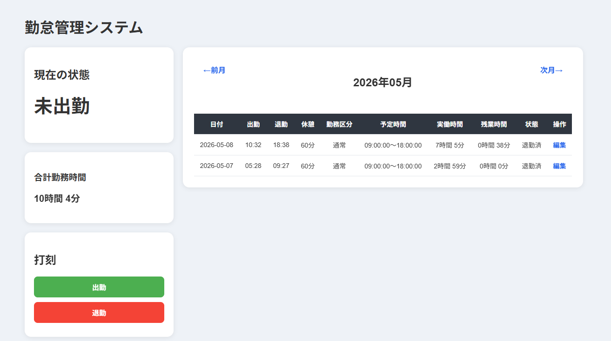

# 勤怠管理アプリ

## 概要

Laravelを使用して作成したシンプルな勤怠管理アプリです。
出勤・退勤の打刻、勤怠一覧の表示、勤務時間の編集機能を実装しています。

---

## 機能一覧

* 出勤打刻
* 退勤打刻
* 勤怠一覧表示
* 勤務時間編集
* 勤務時間の自動計算（出勤〜退勤）

---

## 使用技術

* PHP（Laravel）
* MySQL
* Docker（Laravel Sail）
* Blade

---

## 画面イメージ

### 勤怠画面一覧

### 編集画面

---

## 工夫した点

* 出勤・退勤の二重打刻を防止
* 出勤前の退勤を防ぐバリデーション実装
* 外部キー制約を意識したデータ設計
* Docker環境での開発

---

## 苦労した点

* 外部キー制約によるエラーの解決
* Docker環境でのDB接続エラー対応
* Bladeテンプレートの構文エラー修正

---

## 今後の改善点

* 月別表示機能の追加
* 合計勤務時間の表示
* UI/UXの改善（デザイン調整）
* ログイン機能の追加（任意）

---

## 補足

※本アプリは課題要件によりログイン機能は実装していません。
そのため、user_idは固定値で動作しています。
